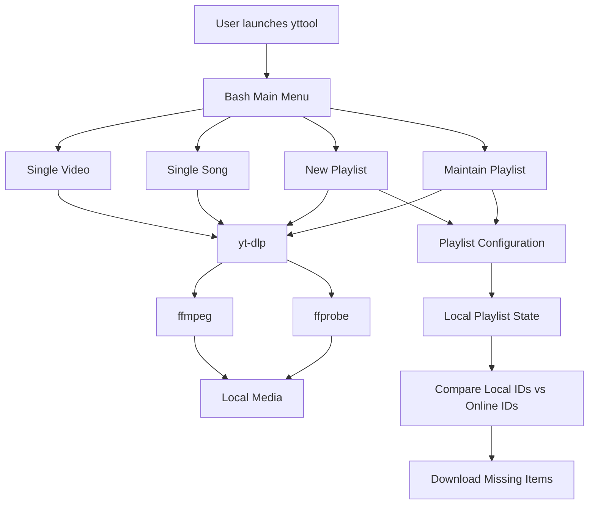
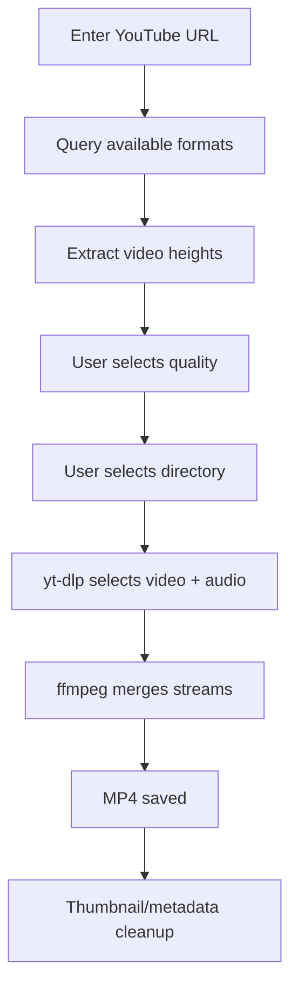
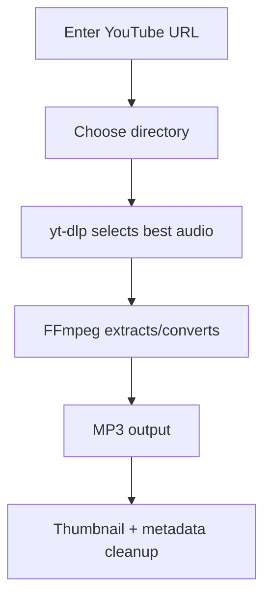
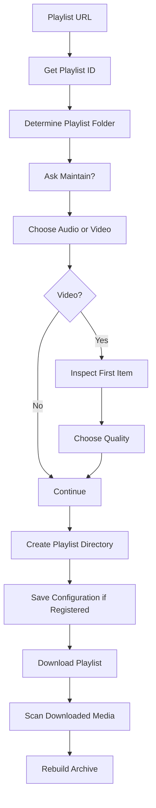
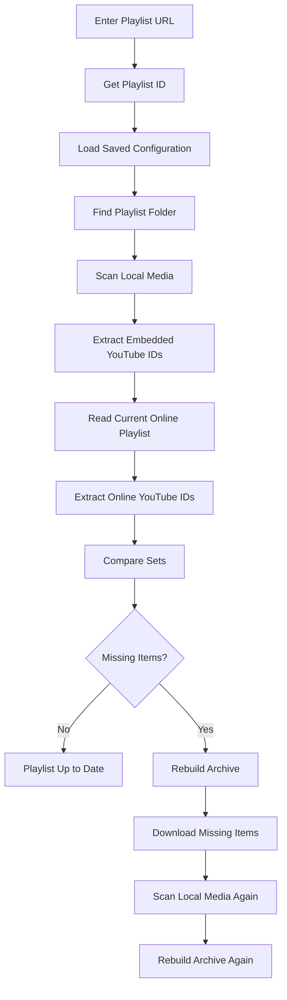

# yttool

> A terminal-based YouTube utility for downloading videos, extracting songs, and managing persistent playlists with automatic update detection.

`yttool` is a Bash-based command-line utility built around [`yt-dlp`](https://github.com/yt-dlp/yt-dlp), `ffmpeg`, and `ffprobe`. It provides an interactive terminal menu so you can download individual YouTube videos or songs, download entire playlists, and later maintain registered playlists by detecting and downloading newly added or locally missing items.

---

# 1. Overview

## What is yttool?

`yttool` is a lightweight terminal application designed to make common YouTube download tasks easier without repeatedly typing long `yt-dlp` commands.

Instead of remembering command-line flags, you launch `yttool` and navigate an interactive menu using the **Arrow Keys** and **Enter**.

The main menu provides four core operations:

```text
yttool
│
├── Download a single video
├── Download a single song
├── Download a new playlist
├── Maintain an existing playlist
└── Quit
```

The application is intentionally implemented as a single Bash script. Most of the actual media-processing work is delegated to well-established command-line tools:

- **Bash** — application logic and terminal interface
- **yt-dlp** — YouTube extraction and downloading
- **ffmpeg** — audio extraction, conversion, and media processing
- **ffprobe** — reading embedded media metadata

The script also maintains its own configuration and playlist state under:

```text
~/.config/yttool/
```

unless `XDG_CONFIG_HOME` is set. The playlist configuration is stored inside a `playlists` directory. 

## Why yttool?

The goal is to provide a simple workflow:

```text
Paste URL
   ↓
Choose options
   ↓
Download
   ↓
Organized media
   ↓
Embedded YouTube ID
   ↓
Future maintenance
```

The playlist-maintenance system is particularly important. Instead of blindly downloading an entire playlist again, `yttool` compares the current online playlist against the media that actually exists locally and downloads only the missing items.

## Main capabilities

### Individual downloads

- Download a single YouTube video.
- Inspect available video resolutions.
- Select the desired maximum video quality.
- Download and merge video + audio into MP4.
- Download a single YouTube video as an MP3.
- Embed thumbnails and metadata.

### Playlist downloads

- Download an entire YouTube playlist as MP3 or MP4.
- Select a target video quality for video playlists.
- Automatically organize playlist items into a playlist folder.
- Register a playlist for future maintenance.
- Maintain registered playlists later.

### Playlist maintenance

- Read the current online playlist.
- Scan the local media directory.
- Recover YouTube IDs from embedded media metadata.
- Compare local media against the online playlist.
- Detect missing items.
- Download missing items.
- Rebuild the local archive from files that actually exist.
- Recover from interrupted or incomplete downloads without permanently trusting stale archive entries.

---

# 2. Features & How to Use

## 2.1 Launching yttool

Once installed, simply run:

```bash
yttool
```

You will see:

```text
yttool — YouTube utility

Main menu

  ❯ Download a single video
    Download a single song
    Download a new playlist
    Maintain an existing playlist
    Quit

↑/↓ select  Enter confirm  q back/quit
```

Navigation:

| Key | Action |
|---|---|
| `↑` | Move selection up |
| `↓` | Move selection down |
| `Enter` | Select |
| `q` / `Q` | Go back / quit the current menu |

The menu system is implemented directly in Bash and reads keyboard input without requiring an external menu framework.

---

## 2.2 Download a Single Video

Select:

```text
Download a single video
```

### Step 1 — Enter the YouTube URL

The program asks:

```text
YouTube URL:
```

Paste the URL and press Enter.

The URL cannot be empty.

### Step 2 — Check available qualities

`yttool` asks `yt-dlp` for the formats available for that video.

It extracts the available video heights and displays them as options such as:

```text
Available video qualities

  ❯ 1080p
    720p
    480p
    360p
```

The available resolutions depend on the video.

### Step 3 — Select quality

Use the arrow keys and press Enter.

The selected value becomes the maximum desired video height.

For example:

```text
720p
```

means `yttool` will attempt to obtain the best available video stream up to 720p.

### Step 4 — Choose the download directory

You will be asked:

```text
Download location:
```

If you enter nothing, the current working directory is used.

The directory is created automatically if it does not already exist.

### Step 5 — Download

The program uses `yt-dlp` to select the best video/audio combination within the selected quality limit.

The resulting media is merged into:

```text
MP4
```

Files are named using the YouTube video title:

```text
Video Title.mp4
```

### Metadata

The download process also:

- embeds the thumbnail,
- embeds available metadata,
- embeds the YouTube video ID into the media comment tag,
- prevents overwriting existing files,
- continues partial downloads,
- disables modification-time preservation,
- uses Windows-compatible filenames.

After downloading, temporary thumbnail files and `.info.json` sidecar files are cleaned up.

---

## 2.3 Download a Single Song

Select:

```text
Download a single song
```

### Step 1 — Enter URL

Enter the YouTube URL.

### Step 2 — Choose location

Enter the directory where the song should be saved.

If left empty, the current directory is used.

### Step 3 — Download

`yttool` requests the best available audio and converts it to:

```text
MP3
```

The audio quality is set to the highest quality setting supported by the `yt-dlp`/FFmpeg workflow.

The output filename is based on the YouTube title:

```text
Song Title.mp3
```

Thumbnail and metadata embedding are also enabled.

---

# 2.4 Download a New Playlist

Select:

```text
Download a new playlist
```

### Step 1 — Enter playlist URL

Enter:

```text
Playlist URL:
```

`yttool` first determines the playlist's YouTube ID.

The playlist ID becomes the permanent identifier used internally by `yttool`.

### Step 2 — Choose download location

Choose the directory where the playlist should be stored.

`yttool` determines the playlist folder name using the same filename rules used by `yt-dlp`.

The resulting structure is approximately:

```text
Download Location/
└── Playlist Name/
    ├── 001 - First Video.mp3
    ├── 002 - Second Video.mp3
    ├── 003 - Third Video.mp3
    └── ...
```

For video playlists, the files use `.mp4`.

### Step 3 — Decide whether to maintain the playlist

You will see:

```text
Maintain this playlist?

  ❯ Yes
    No
```

### What does "Maintain" mean?

If you choose **Yes**, `yttool` saves configuration for the playlist.

This allows you to later select:

```text
Maintain an existing playlist
```

and have `yttool` check whether the online playlist contains items that are missing locally.

If you choose **No**, the playlist is downloaded normally without being registered for future maintenance.

### Step 4 — Choose media type

You can choose:

```text
Audio (MP3)
Video (MP4)
```

### Step 5 — Video quality

If you selected video, `yttool` inspects the first playlist item to determine available video qualities.

You then choose the desired maximum resolution.

### Step 6 — Download

The playlist is downloaded using `yt-dlp`.

For audio:

```text
Best available audio
        ↓
FFmpeg extraction/conversion
        ↓
MP3
```

For video:

```text
Video stream + audio stream
        ↓
FFmpeg merge
        ↓
MP4
```

### Playlist archive

When a playlist is registered, `yttool` creates an archive file.

The archive contains YouTube IDs in this form:

```text
youtube VIDEO_ID
```

However, the archive is not treated as the ultimate source of truth during maintenance.

After a playlist download, `yttool` scans the actual local media and rebuilds the archive from the IDs it can find in existing files.

This is an important self-healing behavior.

---

# 2.5 Maintain an Existing Playlist

Select:

```text
Maintain an existing playlist
```

This feature is the main reason for registering playlists.

### Step 1 — Enter the playlist URL

Enter the same YouTube playlist URL used when registering the playlist.

`yttool` obtains the playlist ID.

### Step 2 — Find saved configuration

The program searches its configuration directory for that playlist ID.

If the playlist has not been registered, you will see:

```text
This playlist is not registered yet.
Use 'Download a new playlist' and choose Maintain = Yes first.
```

### Step 3 — Load saved settings

For a registered playlist, `yttool` loads:

- playlist URL
- download directory
- audio/video mode
- video quality
- playlist folder
- download archive

It then displays the saved settings.

Example:

```text
Mode: VIDEO
Quality target: 720p
Location: /media/music
Playlist folder: My Playlist
```

### Step 4 — Scan local media

`yttool` recursively scans the playlist folder for supported media files.

Supported formats include:

```text
.mp3
.mp4
.m4a
.mkv
.webm
.m4v
.mov
.flac
.ogg
.opus
```

For every media file, `ffprobe` reads the `comment` metadata tag.

`yttool` expects the YouTube ID to be stored there.

### Step 5 — Read the current online playlist

`yt-dlp` retrieves the current list of video IDs from YouTube.

The script creates two sets:

```text
LOCAL IDS
ONLINE PLAYLIST IDS
```

Then it calculates:

```text
ONLINE - LOCAL
```

The result is the list of items that are currently in the playlist but are missing from local storage.

### Step 6 — Missing items

If there are no missing items:

```text
Playlist is already up to date.
```

If missing items exist:

```text
3 missing item(s) detected. Downloading...
```

Only the missing content needs to be downloaded.

### Step 7 — Self-healing archive

Before downloading, the archive is rebuilt from the media that actually exists locally.

After downloading, the local media is scanned again and the archive is rebuilt one more time.

This protects against a situation where an archive claims that an item exists even though its corresponding media file was deleted or a previous download failed.

---

# 2.6 How YouTube IDs Are Stored

`yttool` does not depend on the filename to identify a downloaded video.

Instead, the YouTube video ID is embedded into the media's `comment` metadata tag.

For example:

```text
Video file
   │
   ├── filename → My Video.mp4
   │
   └── metadata
         └── comment → dQw4w9WgXcQ
```

During maintenance, `ffprobe` reads this value.

The script accepts:

```text
Raw YouTube ID
```

or IDs embedded inside:

```text
https://www.youtube.com/watch?v=VIDEO_ID
```

or:

```text
https://youtu.be/VIDEO_ID
```

This means the filename can change without destroying the video's identity.

---

# 3. Internal Workflow

This section explains what actually happens inside `yttool`.

## 3.1 High-Level Architecture



The Bash script acts as the coordinator.

`yt-dlp` handles YouTube interaction, while FFmpeg handles media processing and FFprobe reads metadata.

---

## 3.2 Startup

The script starts with:

```bash
#!/usr/bin/env bash
set -Eeuo pipefail
```

This tells the operating system to execute it with Bash.

The strict-mode flags make the script more defensive:

- `-e` — stop when an unexpected command fails.
- `-E` — preserve ERR trap behavior in functions.
- `-u` — treat unset variables as errors.
- `pipefail` — make pipelines fail when an earlier command fails.

The application name and configuration directories are then initialized.

```text
$XDG_CONFIG_HOME/yttool/
```

or, when `XDG_CONFIG_HOME` is not defined:

```text
~/.config/yttool/
```

The playlist directory is created automatically.

---

## 3.3 Dependency Check

Before anything else happens, the script checks:

```text
yt-dlp
ffmpeg
ffprobe
```

The helper function:

```bash
need_cmd()
```

uses `command -v` to verify that each command exists in the system's `PATH`.

If one is missing, the program exits with a clear message.

This prevents confusing failures later in the workflow.

---

## 3.4 Terminal Menu System

The interactive menu is implemented entirely in Bash.

The menu:

1. Displays the available choices.
2. Tracks the selected index.
3. Reads one keyboard character at a time.
4. Detects arrow-key escape sequences.
5. Moves the selection.
6. Returns the selected index when Enter is pressed.

The currently selected option is displayed with:

```text
❯
```

The menu does not require a third-party terminal UI library.

---

## 3.5 URL Input

The URL helper repeatedly asks for input until a non-empty value is provided.

This is used for:

```text
Single video
Single song
New playlist
Existing playlist
```

---

## 3.6 Download Directory Handling

The directory helper:

1. Reads the user's desired path.
2. Defaults to the current directory if empty.
3. Expands paths beginning with `~`.
4. Creates the directory if required.
5. Converts it to an absolute path.

This means later operations work with a normalized directory path.

---

# 3.7 Common yt-dlp Configuration

The script defines a common set of options used across downloads.

Conceptually:

```text
Common Download Options
│
├── Do not overwrite existing files
├── Continue partial downloads
├── Download thumbnail
├── Embed thumbnail
├── Embed metadata
├── Embed YouTube ID into comment metadata
├── Disable file modification-time preservation
└── Use Windows-compatible filenames
```

The important part for playlist maintenance is:

```text
YouTube ID → media comment tag
```

That ID becomes the connection between a local media file and its original YouTube video.

---

# 3.8 Video Quality Detection

For a single video, `yttool` executes:

```text
yt-dlp -F URL
```

This asks `yt-dlp` for the available formats.

The script then parses the format table and extracts video heights such as:

```text
2160
1440
1080
720
480
360
```

Duplicates are removed and the values are sorted from highest to lowest.

They are presented to the user as:

```text
2160p
1440p
1080p
720p
...
```

The selected quality becomes a maximum height constraint for the download format selector.

---

# 3.9 Single Video Download Workflow



The format selection prefers:

```text
best video <= selected height
+
best audio
```

with fallback formats when necessary.

The final output is merged into MP4.

---

# 3.10 Single Song Workflow



The script uses:

```text
bestaudio/best
```

and FFmpeg audio extraction with MP3 as the target format.

---

# 3.11 Playlist Configuration

Registered playlists are stored under:

```text
~/.config/yttool/playlists/
```

Each playlist gets its own directory based on the YouTube playlist ID.

Conceptually:

```text
~/.config/yttool/
└── playlists/
    └── PLAYLIST_ID/
        ├── url
        ├── location
        ├── mode
        ├── quality
        ├── folder
        └── archive.txt
```

The files contain simple text values rather than requiring a database.

This keeps the configuration easy to inspect and portable.

---

# 3.12 Playlist Download Workflow



The playlist output uses:

```text
%(playlist_index)03d - %(title)s
```

which produces filenames such as:

```text
001 - Introduction.mp3
002 - Chapter Two.mp3
003 - Final Chapter.mp3
```

---

# 3.13 Playlist Maintenance Workflow

Playlist maintenance is more sophisticated than simply using `yt-dlp`'s archive.

The process is:



This distinction is important.

The archive is treated as a **cache**, while the actual files on disk are treated as the authoritative local state.

---

# 3.14 Local ID Extraction

For every supported media file, `yttool` executes an `ffprobe` query against:

```text
format_tags=comment
```

The returned value is checked.

If it contains an 11-character YouTube ID, it is accepted directly.

The script also understands IDs contained in standard YouTube URLs.

Files without a valid YouTube ID are ignored during playlist-state reconstruction.

This prevents unrelated media from being accidentally treated as playlist items.

---

# 3.15 Comparing Local and Online State

The maintenance system creates:

```text
local_ids
playlist_ids
missing_ids
```

The online playlist represents:

```text
What should exist
```

The local media scan represents:

```text
What actually exists
```

The missing set is calculated as:

```text
ONLINE PLAYLIST IDs
        MINUS
LOCAL MEDIA IDs
        =
MISSING IDs
```

The Unix `comm` utility performs this comparison after both ID lists are sorted.

---

# 3.16 Why the Archive Is Rebuilt

A normal download archive can become stale.

For example:

```text
1. Video downloaded
2. Archive records Video ID
3. User deletes video manually
4. Archive still contains Video ID
```

If the archive were trusted blindly, the program could believe the file still exists.

`yttool` avoids this by rebuilding the archive from the files that are actually present.

```text
Actual media
     ↓
Read embedded YouTube IDs
     ↓
Generate fresh ID list
     ↓
Rebuild archive
```

After a maintenance download, the same process happens again.

This makes the archive effectively self-healing.

---

# 3.17 Cleanup System

After downloads, `yttool` performs two cleanup operations.

### Thumbnail cleanup

Temporary thumbnail sidecars created for embedding are removed when they correspond to an existing media file.

Supported thumbnail extensions include:

```text
.webp
.jpg
.jpeg
.png
.avif
```

### Metadata JSON cleanup

Any:

```text
*.info.json
```

files are deleted.

The result is a cleaner media directory without unnecessary sidecar files.

---

# 3.18 Configuration Migration

The maintenance system contains a small migration mechanism for older configurations.

If an older playlist configuration does not contain a saved folder name, `yttool` calculates the playlist folder name and saves it.

This allows older configurations to continue working with the newer folder-based behavior.

---

# 3.19 Error Handling Philosophy

The script uses defensive shell programming and performs several checks before destructive or expensive operations.

Examples include:

- checking required dependencies,
- rejecting empty URLs,
- validating playlist IDs,
- validating available quality information,
- verifying playlist configuration,
- ignoring media without recognizable YouTube IDs,
- cleaning temporary files,
- rebuilding archives after maintenance.

The objective is to make playlist state reflect actual files rather than assumptions.

---

# 4. Dependencies & Installation

## 4.1 Required Dependencies

`yttool` requires:

| Dependency | Purpose |
|---|---|
| Bash | Runs the application |
| yt-dlp | YouTube extraction and downloading |
| FFmpeg | Media conversion and stream merging |
| FFprobe | Reading embedded media metadata |

`ffprobe` is normally included with the FFmpeg package.

---

# 4.2 Install Dependencies on Debian / Ubuntu

Update package information:

```bash
sudo apt update
```

Install FFmpeg:

```bash
sudo apt install ffmpeg
```

Install yt-dlp:

```bash
python3 -m pip install -U yt-dlp
```

If your system manages Python packages externally and refuses a global pip installation, use your distribution's package manager or an isolated installation method appropriate for your system.

Verify:

```bash
yt-dlp --version
ffmpeg -version
ffprobe -version
```

All three commands should return version information.

---

# 4.3 Install Dependencies on Arch Linux

```bash
sudo pacman -S ffmpeg yt-dlp
```

Then verify:

```bash
yt-dlp --version
ffmpeg -version
ffprobe -version
```

---

# 4.4 Install Dependencies on Fedora

```bash
sudo dnf install ffmpeg yt-dlp
```

Then verify:

```bash
yt-dlp --version
ffmpeg -version
ffprobe -version
```

---

# 4.5 Download yttool

Clone the repository:

```bash
git clone https://github.com/YOUR_USERNAME/YOUR_REPOSITORY.git
```

Enter the repository:

```bash
cd YOUR_REPOSITORY
```

Assuming the script is called:

```text
yttool.sh
```

make it executable:

```bash
chmod +x yttool.sh
```

Run it:

```bash
./yttool.sh
```

---

# 4.6 Install yttool as a Terminal Command

If you want to run:

```bash
yttool
```

from anywhere, copy the script into a directory in your `PATH`.

For a system-wide installation:

```bash
sudo install -m 755 yttool.sh /usr/local/bin/yttool
```

Now run:

```bash
yttool
```

from any directory.

You can verify where the command is coming from:

```bash
command -v yttool
```

Expected output:

```text
/usr/local/bin/yttool
```

---

# 4.7 User-Level Installation Without sudo

If you prefer not to install anything system-wide:

```bash
mkdir -p ~/.local/bin
```

Then:

```bash
cp yttool.sh ~/.local/bin/yttool
chmod +x ~/.local/bin/yttool
```

Make sure `~/.local/bin` is in your `PATH`.

For Bash:

```bash
echo 'export PATH="$HOME/.local/bin:$PATH"' >> ~/.bashrc
```

Reload the shell:

```bash
source ~/.bashrc
```

Then:

```bash
yttool
```

---

# 4.8 First Run

After installation:

```bash
yttool
```

Choose:

```text
Download a single video
```

Paste a YouTube URL.

Then:

1. Select a video quality.
2. Select a download directory.
3. Wait for the download to finish.

For a song:

```text
Download a single song
```

For a playlist:

```text
Download a new playlist
```

If you want automatic future maintenance, choose:

```text
Maintain this playlist?
→ Yes
```

---

# 4.9 Configuration Location

By default:

```text
~/.config/yttool/
```

The playlist configuration is stored at:

```text
~/.config/yttool/playlists/
```

A registered playlist looks approximately like:

```text
~/.config/yttool/
└── playlists/
    └── PLxxxxxxxxx/
        ├── url
        ├── location
        ├── mode
        ├── quality
        ├── folder
        └── archive.txt
```

You can change the base configuration location using:

```bash
export XDG_CONFIG_HOME="/some/other/location"
```

Then `yttool` will use:

```text
/some/other/location/yttool/
```

instead of:

```text
~/.config/yttool/
```

---

# 4.10 Troubleshooting

## `Missing dependency: yt-dlp`

Install `yt-dlp` and verify:

```bash
yt-dlp --version
```

---

## `Missing dependency: ffmpeg`

Install FFmpeg:

```bash
sudo apt install ffmpeg
```

or use the equivalent command for your distribution.

---

## `Missing dependency: ffprobe`

`ffprobe` normally comes with FFmpeg.

Verify:

```bash
ffprobe -version
```

If it is missing, reinstall the FFmpeg package.

---

## `yttool: command not found`

Check whether the installation directory is in your `PATH`:

```bash
echo "$PATH"
```

Then check:

```bash
command -v yttool
```

If you installed it into `~/.local/bin`, make sure that directory is included in your `PATH`.

---

## Playlist says it is not registered

The playlist must first be registered through:

```text
Download a new playlist
        ↓
Maintain this playlist?
        ↓
Yes
```

After that, use:

```text
Maintain an existing playlist
```

---

# Project Structure

A typical repository can remain very small:

```text
yttool/
├── yttool.sh
├── README.md
└── LICENSE
```

The application's runtime configuration is stored outside the repository under the user's configuration directory.

---

# Technical Summary

```text
                 ┌─────────────────────┐
                 │       User          │
                 └──────────┬──────────┘
                            │
                            ▼
                 ┌─────────────────────┐
                 │      yttool         │
                 │       Bash          │
                 └──────────┬──────────┘
                            │
              ┌─────────────┼─────────────┐
              │             │             │
              ▼             ▼             ▼
          ┌───────┐     ┌────────┐    ┌─────────┐
          │yt-dlp │     │ ffmpeg │    │ ffprobe │
          └───┬───┘     └────┬───┘    └────┬────┘
              │              │              │
              └──────────────┼──────────────┘
                             ▼
                    ┌────────────────┐
                    │  Local Media   │
                    └───────┬────────┘
                            │
                            ▼
                    ┌────────────────┐
                    │ Embedded YT ID │
                    └───────┬────────┘
                            │
                            ▼
                    ┌────────────────┐
                    │ Playlist State │
                    └────────────────┘
```

The key design principle is simple:

> **The media files are the source of truth; the archive is a rebuildable cache of that state.**

This allows `yttool` to maintain playlists without permanently trusting an archive that may no longer represent what is actually stored on disk.

---

# License

Copyright (c) 2026 Rounak Swarnam

This project is licensed under the MIT License.

The MIT License permits you to:

- Use the software.
- Copy the software.
- Modify the software.
- Merge the software into other projects.
- Publish modified versions.
- Distribute the software.
- Use the software commercially.

The main requirement is that the copyright notice and license text remain with copies or substantial portions of the software.


---

# Disclaimer

`yttool` is a command-line utility built around `yt-dlp`.

Users are responsible for complying with YouTube's Terms of Service, applicable copyright laws, and the rights of content creators when downloading or storing media.

Use the tool responsibly and only download content you are authorized to download.


Users are responsible for:

- Ensuring they have permission to download the content they download.
- Respecting copyright.
- Respecting the rights of content creators.
- Following YouTube's applicable terms and policies.
- Following the laws applicable to them.

Use this software responsibly.

---

# ThankYou !!
